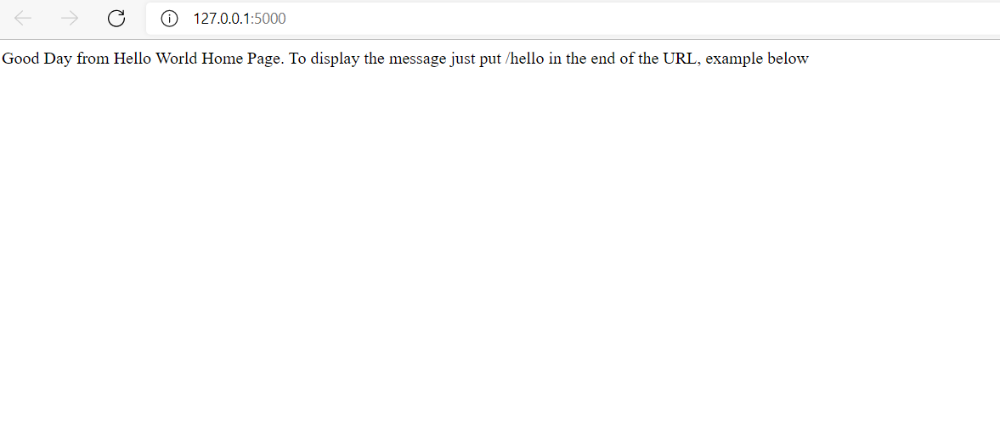
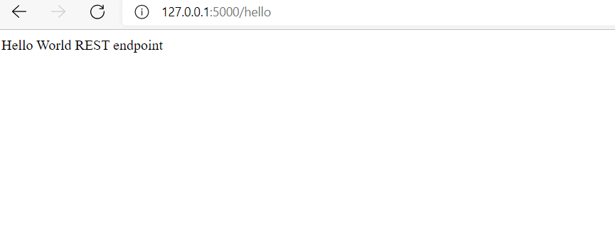
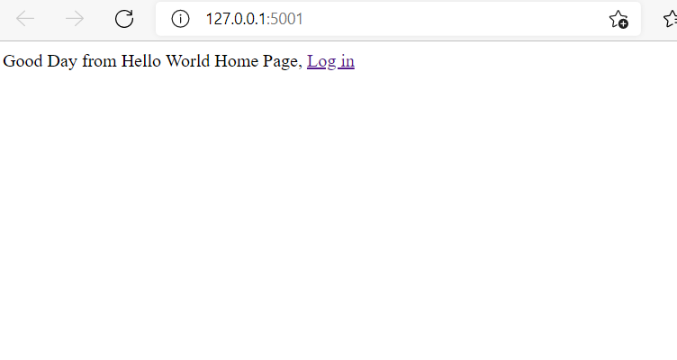
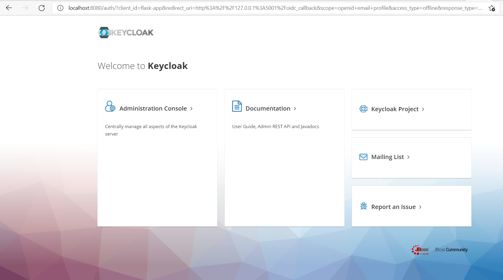
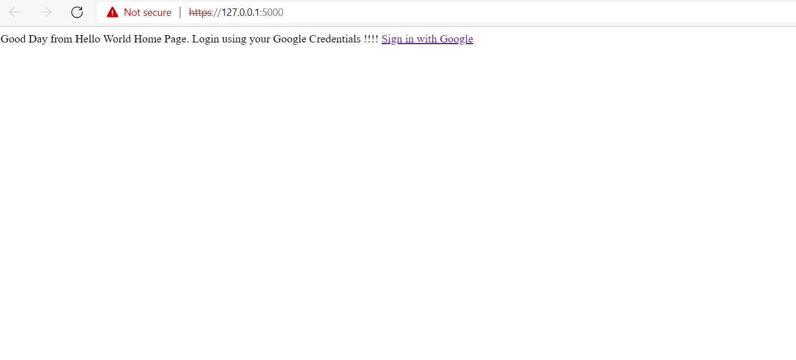
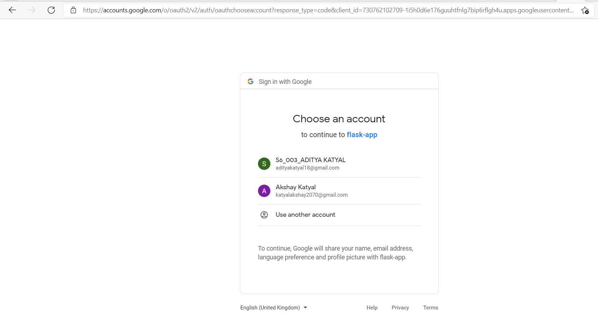
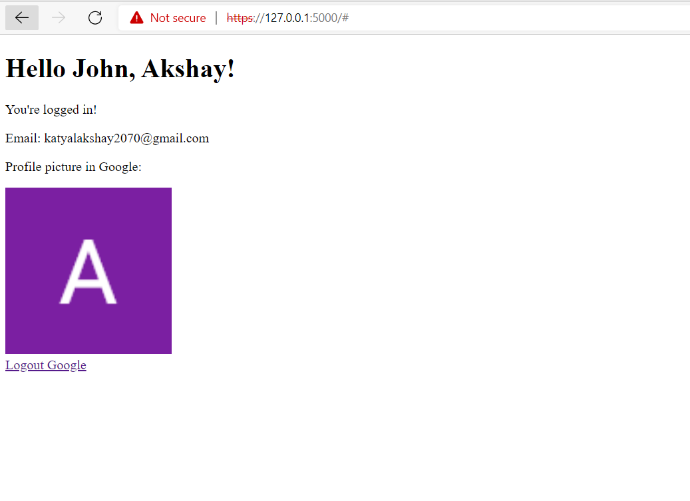

<h3>Tech11 DevOps Tasks</h3>

### Task2.1.1:
- Hello world API named file api_hello.py
- Dockerfile for running the image, the docker file can be invoked by the command `docker build --tag python-docker`
- The working of the api is shown in the screenshots below:
- 
- 

### Task2.1.2
- This task was to create a pipeline for the Hello world API designed in task1 above so here the pipeline I created using Jenkins that helps to create pipeline using GIT source code. The file is named as 'Jenkinsfile' that has the complete pipeline

### Task2.1.3
- The Hello John task using the Keycloak from RedHat so this service is to create a authentication for the user and login to the keycloak data. 
- The task is developed using Keycloak login and authentication
- The application gets the credentials using the secrets file, that is json file storing secrets for login
- The working of the application BY COMMAND `docker build --tag python-keycloak` is given by screenshots as:
- 
- 

### Task2.1.4
- This task is for performing the login using the social media, so for this I am using Google to perform login for the Hello World API 
- The google login supports Oauth login to the system
- Getting the username, mail-id, and image of the user
- The working of the application is given by command `python app.py`, this is shown by screenshots as:
- 
- 
- 

### Task2.2
For task2.2 as it asks regarding management of security credentials for various services, so I have written my answer in bullet points in the `Answer.md` file. 

-------------------------------------------------------------------------------------------------------------
